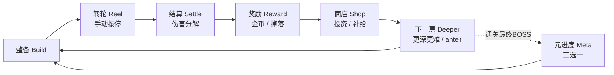

# 游戏策划总纲 · 老虎机对决 × 挺进地牢（seek_dead）

> **定位**：一份把「老虎机对决」与「挺进地牢（Enter the Gungeon）式 Roguelike 地牢」缝合起来的**总策划文档**。
> 它回答「我们到底在做一款什么游戏、为什么好玩、怎么长线」，并把已落地的系统组织到一个可读的框架里。
> 各系统的**数值 / 实现 / 代码映射**见关联文档（见文末「文档地图」），本文不重复细节。
>
> **两条核心诉求（用户拍板）**：
> 1. 带来**数值爆炸的爽感**。
> 2. 玩法和计算**不要过于复杂**。
>
> 一句话：**老虎机作武器，地牢作舞台——转轮就是你的枪，三连就是你的暴击。**

---

## 0. 概念与核心幻想（Concept）

**「你手里没有枪，你手里是一台老虎机。」**

玩家扮演一名深入地牢的冒险者。在挺进地牢的世界里，敌人会开枪、会放弹幕、有弱点和护甲；而你的攻击方式不是扣扳机，而是**拉动转轮**——每一列停下的符号就是这一发打出去的「弹药」。武器决定转轮带由哪些符号组成（火剑带火格、冰枪带冰格），元素克制决定打在敌人身上是「×1.5 弱点爆发」还是「×0.85 被抗」。

这把老虎机不是纯运气：
- **build 层**决定转轮带里有什么（带什么武器、配什么护符、赌什么元素）；
- **技能层**决定你手停得准不准（转速越来越快，越转越难停在想要的符号上）；
- **结算层**把「大数字」拆给你看（基础 × 连线 × 护符 × 克制），让你爽得明白。

**为什么是「老虎机 × 挺进地牢」**：
- 挺进地牢提供 Roguelike 骨架（房间 / 精英 / BOSS / 商店 / 元进度 / 每局不同）与「带对装备才能打穿弱点」的装备驱动手感；
- 老虎机提供「看得见的随机」与「连线即爆发」的爽点引擎；
- 二者缝合后：地牢是策略的舞台（你带什么进去），老虎机是策略的兑现（你转出了什么）。

---

## 1. 类型与对标（Genre & References）

| 维度 | 定位 |
| --- | --- |
| **类型** | Roguelike 地牢探索 + 老虎机战斗结算（回合制、单赔付线） |
| **主对标** | 挺进地牢（地牢结构 / 武器驱动 / BOSS 机制 / 元解锁） |
| **结算灵感** | 小丑牌 Balatro（乘区爆炸 + 伤害分解可读） |
| **卡组位置** | 杀戮尖塔（build 决策在局前 / 局间，战斗内是兑现） |
| **操作层** | 真人老虎机（手动按停，转速=难度，眼力手速=技巧） |
| **单局时长** | ~60 分钟（3 列手动停 × 30 房；2026-08-09 重排：3 幕 × 4普通+2精英+4场BOSS战） |
| **平台 / 引擎** | PC，Godot 4.7 |

**与小丑牌的关键差异**：小丑牌玩家完全掌控出什么牌；老虎机是纯随机出符号。**所以我们把策略放在 build 层（转轮之前），不在战斗内堆乘区**——否则「随机符号 × 一堆看不出哪个生效的乘区」会变成黑箱，反而削弱老虎机。这是整个设计的基石（见 §9）。

---

## 2. 设计支柱（Design Pillars）

1. **爽感可解（P0）**：每一个大数字都能分解出「为什么这么大」（伤害分解显示，§4.4）。
2. **策略在 build 层（P1）**：决策发生在整备 / 商店 / 升级；战斗内是兑现（纯随机连线爽感）。
3. **温和奖罚（P2）**：保留「带对克 ×1.5 / 带错抗 ×0.85」的真实相克，但幅度温和、从敌人视角呈现（弱点 / 抗性），不背环、不崩盘。
4. **少而强的乘区（P3）**：乘区数量少（3 个：连线 / 护符 / 克制），每个都直观。
5. **双轨膨胀（P4）**：线性（武器升级）× 乘法（护符），两条线玩家算得过来。
6. **敌我同步膨胀（P6）**：玩家变强，怪物同步变强（ante 曲线），否则中期秒怪、游戏提前结束。
7. **禁 mutate 共享 .tres（P7）**：局内改动一律走「按 `resource_path` 的运行时加成表」，绝不改共享资源。
8. **内容广度撑长尾（P8）**：长线新鲜感靠更多武器 / 护符 / 敌人 / 房间，**不靠再加系统**。
9. **技能层归玩家（P9）**：转轮结果由玩家按停时机决定，不设自动兜底。
10. **槽位按「是否进池」管控（P10）**：进转轮池的（武器 / 技能）稀释带子须限量；不进池的（消耗品 / 护符）只占界面，可宽松。

---

## 3. 核心循环（Core Loop）



- **策略**发生在：整备（选武器 / 符号池）、商店（投资配比）、升级（线性 vs 乘法）。
- **技巧**发生在：转轮（按停时机，见 §4.3）。
- **爽感**发生在：转轮（连线命中）、结算（大数字 + 分解）。

**一局（run）结构**：`30 房 = 3 幕 ×（4 普通 + 2 精英 + 4 场 BOSS 战）`。每局 `_full_reset` 时从全量 51 间 `.tres` 池按幕抽取（每幕 4 普通 + 2 精英 + 4 场 BOSS 战（轮替→轮替→固定幕终→隐秘））——不同 run 体验不同。通关**最终** BOSS 才弹元进度三选一（见 §8）。

---

## 4. 战斗：老虎机转轮（Combat = Slot Reels）

战斗是回合制：玩家按 SPIN → 转轮旋转 → 玩家手动按停每一列 → 落定后 `_evaluate` 按「符号 + 有效元素」计数并结算伤害。

### 4.1 转轮带模型（方案 A：实体带子 + 手动停）

- **转轮带** `reel_strips[r]` = `Array[[SymbolData, element]]`，由合并符号池按**权重展开成格子**后洗牌；每列一份副本（同构成、异顺序）。**权重 = 带子上该符号的格子数**——概率与带子长度一一对应，不再是一张后台黑箱概率表。
- **最小带长** `_STRIP_MIN_CELLS = 30`：带子过短时整份平铺补足，只拉长视觉周期，**各符号占比、命中概率完全不变**。
- **旋转** `_spin_timer` 节拍器，每跳推进 `reel_cursor[r]`；加速 `0.09s → 0.035s`（约 37 跳封顶，≈28 格/秒）。
- **停止** = 玩家操作，落点 = 按停瞬间的 `reel_cursor`。**无自动兜底，不停就一直转**。
- **三条停止入口**（均不会被禁用，无卡死风险）：SPIN 按钮 = 停下一列；空格键 = 同；点击某一列 = 单独锁定该列。

**设计意义**：
- 难度来源从「后台概率」迁移到「转速 + 你的眼力手速」。越转越快 = 越难精准停在目标符号。
- 带子长度 = 所有携带武器的权重总和。**带的武器越多，目标符号密度越低、越难按停**——这让槽位收紧有了直接手感反馈（见 §5.2）。
- 调参入口：`_SPIN_BASE_WAIT` / `_SPIN_MIN_WAIT`（主难度旋钮）/ 加速斜率 / `_STRIP_MIN_CELLS`。

### 4.2 单符号伤害 = 3 乘区

```
单符号伤害 = base × 连线数 × 护符 × 克制
回合总伤   = Σ 各落线符号伤害
```

| 乘区 | 来源 | 玩家直觉 |
| --- | --- | --- |
| **连线数** | 老虎机原生 | 同符号连得越多越痛（`mult` = 同符号计数） |
| **护符** | 收集 / 商店 | 护符越多全局越痛（收集爽） |
| **克制** | 带对元素武器 | 弱点 ×1.5 / 抗性 ×0.85 / 无关 ×1.0（策略点） |

> ⚠ **重要机制事实**：结算**不要求凑三连**。`c = 1` 也照常出伤害，`special` 仅在 `c >= 3` 时额外追加一次 base。所以「多带武器」不会让玩家打空——它的代价是**隐形的**（见 §5.2）。

### 4.3 三连暴击（方案 A，刚落地）

- `LoadoutItem` 新增强度轴字段 `crit_mult`（默认 2.0），武器 / 技能共用。
- 三连（`raw >= 3`）时，damage / shield / heal / status / special **全部**按 `_item_crit_map` 查到的 `crit_mult` 结算——**普通符号三连终于有「暴击感」**。
- 退役硬编码 `SPECIAL_TRIPLE_CRIT`（默认 2.0 = 旧 special 倍率，**零回归**）。special 仍保留**破甲 + 连锁叠层**。
- 伤害分解面板中普通 / special 三连都显示「⚡暴击 ×N」。

### 4.4 伤害分解显示（P0 落地）

伤害数字旁给分解，让玩家爽得明白：

```
符号[火·剑]  8 × 连线3 × 护符2 × 克制1.5 = 72
```

爽感的一半来自「看懂这一下为什么这么大」；同时它是 ante 调参的 debug 面板。

### 4.5 克制奖罚并存（温和）

- **弱点 ×1.5，抗性 ×0.85，无关 / 中性 ×1.0**。
- 带对元素（命中敌人弱点）→ 爆发爽点；带错元素（撞上抗性）→ 轻微吃亏但**不崩盘、有退路**（中性武器恒 ×1.0）。
- **呈现层大简化**：底层保留克制数据，但呈现给玩家的是敌人视角的「弱 火 ×1.5 / 抗 毒 ×0.85」，不用背五元环。
- 武器元素化：`WeaponData.element`；符号 `element=="none"` 则继承武器元素；**着色 = 元素**，玩家一眼认出哪个符号吃加成。

### 4.6 反制即爆发（Plan C，已落地）

- **敌人护甲扁平池**（RPG 破甲）：非穿透先扣护甲、溢出进 HP；穿透符号（`shot` / `pistol_shot` / `ice_shot`）直接扣 HP。
- **反制双触发**：`special` 三连 = 通用破甲（开直击 HP 窗口，任何敌人通用）；克制元素三连 = 进阶核爆（额外 `enemy_hp_max × 20%` 穿透）。
- 示例 BOSS「锈蚀傀儡」熔铸护甲：每 2 回合叠 1 层护甲（`ARMOR_PER_STACK=8`，上限 3 层）。

### 4.7 局内爆发杠杆：连锁重触发（已落地）

- 打出 `special` 三连 → **免费重转一次**，且**只有 special 部分**吃连锁倍率 `CHAIN_STEP = 1.5`。
- 连锁可累计：第 n 次重转 special 倍率 = `1.5^n`，上限 `CHAIN_MAX = 4`（理论峰值 special ×3.375）。敌人死亡即中断。
- 这是**唯一的局内乘区**，因果链「我按准了 → 立刻多一次机会」清晰可读，不黑箱。

---

## 5. 构建：地牢背包（Build = Loadout）

四类物品，**各自独立槽位、互不算总**（初始配额之和 2+1+1+1 = 5 只是初始值之和，不是共享闸门）。

### 5.1 四类物品与槽位模型

| 类别 | 初始 | 天花板 | 进池？ | 影响 | 管控尺度 |
| --- | --- | --- | --- | --- | --- |
| **武器** | 2 | **`UNCAPPED` 无上限** | ✅ 进池 | 稀释带子、摊薄克制浓度、拉低目标符号密度 | 稀释自身即刹车 + 递增价（+5/件） |
| **技能** | 1 | **`UNCAPPED` 无上限** | ✅ 进池 | 同上，挤占转轮带最凶 | 同上，步进更陡（+6/件） |
| **消耗品** | 1 | `CONSUMABLE_CAP=4`（固定腰带，不成长） | ❌ 不进池 | 仅占界面与心智 | 硬限 |
| **护符** | 1 | `CHARM_CAP=3` | ❌ 不进池 | 唯一收集乘区，膨胀主引擎 | 硬限（零代价纯收益，步进价最贵） |

**天花板按「进池与否」分野，不按类别拍脑袋**：
- 进池类（武器 / 技能）→ 无天花板。符号挤进同一条转轮带，带越多则废铁占比升高、目标符号命中率被稀释、克制浓度摊薄、按停难度上升——**稀释效应本身就是刹车**，人为封顶属重复收费。约束交给「金币线性递增价 + 稀释代价」。
- 不进池类（消耗品 / 护符）→ 硬天花板。它们不进转轮、零稀释代价、无自然刹车，尤其护符是「唯一收集乘区」纯收益越多越强，必须硬限量（4 / 3）。

### 5.2 多带武器的三条隐形代价

因为 `c = 1` 也结算伤害，多带武器不会让玩家打空，坏处全部隐形。一个没有可感知代价的选项等于没有选项，玩家会一直带满——这比「带满就废」更糟。三条代价：
1. **克制乘区吃不满**：带 1 把火剑→三格全火→全吃 ×1.5；带 5 把杂武器→期望被拉回 ×1.0。
2. **`special` 的 ×3 爆发几乎不触发**：带满等于主动放弃必杀感。
3. **带子变长、按停变难**：1 把武器 ≈ 10 格（火占 50%），5 把 ≈ 50 格（火占 10%）——刚做完的技能层被「带满」废掉。

> **build 层与技能层的耦合是本作特色**：带的武器越少，目标符号在带子上越密、越好按停。「带得少反而好打」这个反直觉的手感差异，是槽位设计能否立住的核心判据。

### 5.3 成长机制「买即开槽」

商店购买某类物品时，若该类当前槽位已满且未触天花板，本次购买**直接把该类上限 +1**。节奏闸门 = 同类价格随已持数递增：

| 槽位 | 初始 | 天花板 | 步进 | 价格曲线（去随机项） |
| --- | --- | --- | --- | --- |
| 武器 | 2 | ∞ | +5 | 8·8·13·18·23·28… |
| 技能 | 1 | ∞ | +6 | 6·12·18·24… |
| 护符 | 1 | 3 | +8 | 10·18·26 |
| 消耗品 | 1 | 4 | +4 | 5·9（固定腰带，可重复购买同类） |

### 5.4 物品职责宪章

- **武器（WeaponData）**：进轮、带符号池、有元素、攻击力差异化（每把武器专属符号 base 各异，如战斧 14 / 铁剑 11 / 火焰剑 10 / 冰枪 9 / 手枪 8 / 匕首 7 / 火焰法杖 special 25）。
- **技能（SkillData，原「增益」改名）**：进轮、初期限 1，机制照搬（如 `haste` 加速、`rage` 增伤）。
- **消耗品（ConsumableData）**：不进轮，固定 4 格腰带，可消耗资源（用掉即消耗，商店是补给唯一来源）。
- **护符（CharmData）**：不进轮，全局乘区 ×N，唯一收集乘区，是数值爆炸主引擎。

---

## 6. 地牢结构：房间 / 精英 / BOSS（Dungeon Run）

> 这是与「挺进地牢」最贴合的一层：你一层层往下打，每间房不同，BOSS 有机制，精英房给战前补给。

- **房间数据** `RoomData`（`kind` = normal / elite / boss + `act` + `gimmick_script`），单敌单元素。当前全量池 51 间 `.tres`（普通 36 / 精英 12 / BOSS 3，单局抽取 30 房 = 4 普通 + 2 精英 + 4 场 BOSS 战/幕）。
- **顺序不靠文件名**：`_sort_rooms` 按 kind 语义重排（修旧字母序难度倒挂）。
- **普通房**：清房 +5 金 + 小增益奖励三选一。
- **精英房（T3）**：数值介于普通与 BOSS 之间；专属「战前补给」三选一（金币囤 +18 / 铁砧点 +2 / 结界备战 +30 护盾）。
- **BOSS 房（T2）**：`boss_gimmick.gd` 基类 + 三 BOSS 子类（熔铸护甲 / 呓语锁轮 / 深渊侵蚀），钩子 `on_room_start / on_turn_begin / on_damaged / on_special_triple` 由 `_start_room` 经 `RoomData.gimmick_script.new()` 实例化。
- **通关整局判定**：`_is_run_final(idx) = idx >= ROOMS.size()-1`——只有通关**最终** BOSS 才 `_full_reset()` 开新局并弹元进度三选一（曾因「是否 BOSS 房」误判导致幕二 / 三不可达，已修）。

---

## 7. 经济与商店（Economy & Shop）

- **局内金币**：击杀 / 清房获得（清房 +5 / Boss +10），**每局清零**（膨胀留局内，防滚雪球）；起始 4 金。利息：清房金币发放时并入 `min(gold//5, 5)`（每 5 金 +1，上限 +5），制造「存钱 vs 消费」决策。
- **转轮金币符号** `gold.tres` 常驻转轮池（权重低、防稀释 DPS），落在线上的金币符号转化为金币、不造成伤害。
- **商店**：房间之间出现（奖励三选一之后），卖武器 / 护符 / 消耗品 / 技能；**刷新随机**（`shuffle()` 取 6 件，防背公式）。三页签：购入 / 卖出（回收约 50%）/ 升级（局内金币升级，均折入现有 3 乘区、不新开第 4 乘区）。
- **同类唯一持有（消耗品除外）**：武器 / 护符 / 技能已拥有则拒单，防重复效果叠加；消耗品用固定 4 格腰带允许同类重复占格。
- **铁砧点 `meta.anvil_points`**：回退跨局 meta（解锁池用），**不进 build、不滚雪球、不与金币兑换**，防跨局买局内战力破坏 ante 曲线。

---

## 8. 元进度 · 局外成长（Meta Progression）

通关最终 BOSS 后弹**元进度三选一**，双轨在 meta 层的具体承载：

| 轨 | 载体 | 常量 | 上限 |
| --- | --- | --- | --- |
| 线性 | `meta.weapon_base_bonus[武器路径]` | `WEAPON_BASE_STEP = 3` | 无（受 ante 曲线制衡） |
| 乘法 | `meta.charm_upgrades[护符路径]` | `CHARM_MULT_STEP = 0.12`/级 | 总乘区硬顶 `CHARM_MULT_CAP = 6.0` |

- 候选构成：本局携带武器各 1 张（+base）+ **仅乘区型护符**各 1 张（+mult）+ 铁砧点数 1 张兜底 → `shuffle()` 取 `META_CHOICE_COUNT = 3`。非 `damage_mult` 的护符出卡 = 假选项，故不出。
- 武器 base 在 `_contribute` 中于所有乘法**之前**叠加，因此同时被护符乘区与连锁倍率放大 → 跨局成长直接喂给局内爆发。

---

## 9. 平衡哲学（Balance Philosophy）

**核心矛盾与解法**（整个框架的根基）：
- 矛盾：小丑牌乘区爆炸成立，因为玩家**完全掌控出什么牌**；老虎机是**纯随机出符号**——玩家对「这一转转出什么」几乎零控制。
- 若照搬小丑牌「战斗内多乘区」：伤害 = 随机符号 × 一堆看不出哪个生效的乘区 = 黑箱，策略感从「我怎么出牌」降级成「我堆了哪些 buff」。
- **解法**：策略放 build 层（转轮之前），膨胀长 build 层（武器升级 × 护符），战斗内只许 **special 连锁重触发这一处局内乘区**。

**膨胀纪律**：
- 双轨：线性（武器升级 8→20）× 乘法（护符 ×N），只有两条线。
- 护符是唯一收集乘区，硬顶 3 件、总乘区封顶 ×6.0，保证乘区可算。
- ante 难度曲线：按幕台阶 × 幕内爬升（`ANTE_ACT_STEP_HP=1.75`/`ATK=1.46`、`ANTE_ROOM_STEP_HP=1.15`/`ATK=1.10`），敌我同步膨胀。

**冻结清单（明确不做）**：塔罗、星球、套装、双货币兑换、强惩罚 ×0.7（改温和 ×0.85）、逐符号复杂元素判定、属性抗性、`REELS 3→4`、转轮自动停。冻结 ≠ 永不做，是「当前不做，避免一次堆太多」。

---

## 10. 美术与呈现方向（Art & Presentation）

> 以下基于已落地 / 已定义的呈现逻辑，作为美术方向的约束与提示。

- **调色板（Palette）**：符号按有效元素着色（火=红、冰=蓝、毒=绿、光=金、暗=紫、特殊=亮色），玩家一眼分辨吃加成的符号；敌人护甲标签用 steel 蓝 `Palette.ARMOR`。
- **伤害数字**：中栏独立面板逐符号推「基础 × 连线 × 克制 = 小计」+ 回合级乘区（护符 / 共鸣 / 连锁）汇总，不进战斗日志（避免倒序冲掉历史）。
- **敌人图例**：首行「敌人 X / 弱 Y ×1.5 / 抗 Z ×0.85」三行分色，从敌人视角给出决策信息。
- **反馈**：暴击「⚡暴击 ×N」、连锁「连锁 ×N」+ ⚡ 飘字、反制核爆即时刷新 HP / 护甲。
- **基调**：赌城霓虹 + 地牢阴郁的反差；转轮是视觉焦点，连线命中要有「叮——」的爽脆感。

---

## 11. 技术架构（Tech Architecture）

> 为了「加内容 = 建 .tres，不改代码」的可扩展铁律。

- **引擎**：Godot 4.7，GDScript。
- **数据即 Resource**：符号 / 物品 = `.tres`，`@export` 直接引用。**禁止全局注册表 / 枚举字典查表**。加内容 = 新建 `.tres`，不改代码、不碰全局表。
- **表现 / 逻辑分离**：`duel_controller` 纯逻辑编排，`battle_hud` 纯 UI；控制器经「只读快照 `BattleState` + 意图信号」驱动 HUD，单向数据流。
- **纯结算抽离**：`battle_math.gd`（`class BattleMath`，全 static func，只进参数出返回值，不碰节点）；控制器留薄包装，零行为变化。
- **覆盖层即场景**：5 套覆盖层（整备 / 奖励 / 元进度 / 商店 / 铁砧）各自独立 `.tscn` + 脚本，`configure(controller, hud)` 注入，共享卡片构造器复用 HUD。
- **平衡常量 @export 化**：24 个策划可调常量移交 Duel 节点 Inspector 拖拽调参（难度曲线 / 命中 / 元进度成长 / 局内升级 / 经济），不再硬编码。
- **扫描发现**：`resource_scan.gd` 按目录自动发现 `.tres`，文件夹即分类（武器 / 护符 / 消耗品 / 技能 / 符号 / 房间）。

---

## 12. 路线图与完成度（Roadmap）

> 权威进度见 `docs/数值膨胀与策略深度设计框架.md` §15。

### ✅ 已完成（MVP 战斗闭环 + 经济 + 结构 + 重构）

| 阶段 | 内容 | 关键提交 |
| --- | --- | --- |
| 战斗闭环 | 3 乘区 + 伤害分解 + 弱点呈现 + 符号着色 + 元素 debuff | `dcaebb1` 等 |
| 经济与防御 | 统一护盾 / 金币 / 商店 / 利息 / 卖出 | `9926365` |
| 双爆发杠杆 | 局内连锁重触发 + 跨局元进度三选一 + 反制即爆发 | `afcfb29` / `4afacf2` / `1978ff7` |
| run 结构 | 30 房 3 幕（每幕 4普通+2精英+4场BOSS战：轮替→轮替→固定幕终→隐秘）/ BOSS 机制 / 精英补给 | S10 |
| 重构 | P0 纯函数 / P1 只读快照 / P2 信号解耦 / P3 常量@export + .tscn 重建 | `90822e3`…`3f8aefb` |
| **三连暴击** | 方案 A：`crit_mult` 强度轴，普通/special 三连统一暴击 | `2864c00` |

### 🟢 待真机验证（阻塞项）

本机无 Godot 二进制，所有改动仅静态校验。**必须用户 F6 跑** §15.3 全表：
- 旋转手感（高速后明显难停但不是不可能）；
- 槽位取舍（带 1 把武器密度 50% 好按停，带 2 把掉到 ~25%）；
- 护符膨胀、ante 变肉、克制感知、灼烧手感；
- **完整跑到幕三 BOSS**、元进度三选一持久化、连锁重触发、消耗品腰带模型、商店金币升级 tab。
- ⚠ 验证时 `TEST_PLAYER_DMG_MULT=1.5` / `TEST_STATUS_DMG_MULT=3.0` 调试倍率仍开启，结论须待改回 `1.0` 后复测（尤其 ante α 调参）。

### 🟡 未开工 / 候选

- **S11 内容广度**：更多武器 / 护符 / 敌人 / 房间 / 事件（长尾靠内容不靠系统）。现有 武器 12 / 护符 10 / 技能 4 / 消耗品 4 / 符号 19。
- **ante α 调参**：真跑满 30 房后血量曲线（幕内 ria 0–9）likely 偏陡，需 F6 实测后下调。
- 元进度候选池扩容（可选）：加入全局未持有武器 / 护符卡。

---

## 13. 开放问题 / 待拍板

| 项 | 当前值 | 规划 | 说明 |
| --- | --- | --- | --- |
| 转轮列数 | `REELS=3`、`ROWS=1` | **维持 3 列** | 4 列已撤销（稀释节奏 / 破坏三连仪式感 / 与槽位收紧打架）；更多格子优先 `ROWS=2` |
| 武器 / 技能槽 | 初始 2 / 1 | **`UNCAPPED` 无顶** | 稀释 + 递增价刹车 |
| 护符槽 | 初始 1 | **`CHARM_CAP=3` 硬顶** | 唯一收集乘区，须硬限 |
| 克制倍率 | ×1.5 / ×0.85 / ×1.0 | 维持 | 可真机微调 |
| ante 初值 | α_hp=0.15 / β_atk=0.10 | **F6 后很可能下调** | 依赖分解面板 + 实测 |
| 旋转速度 | 0.09 → 0.035s | 待真机调 | 主难度旋钮 |
| run 长度 | 30 房（3 幕 × 4普通+2精英+4场BOSS战） | 维持 | ~60 分钟 |

---

## 14. 文档地图（Index）

| 文档 | 用途 |
| --- | --- |
| `docs/数值膨胀与策略深度设计框架.md` | **权威细节 / 平衡圣经**：3 乘区、ante、双爆发、槽位、冻结清单、代码映射、完成度台账 |
| `docs/战斗结算公式速查.md` | 单符号伤害分量、special 1同/2连/3连暴击、阶段乘区链、连锁、敌人回合、常量表 |
| `docs/[已完成]物品中心重构方案.md` / `docs/[已完成]物品分类职责划分.md` | 物品三层模型、四类职责宪章、来源标签、落位表 |
| `docs/[已过时]符号与转轮池规范.md` | 符号频率轴（per-item weight）、转轮池构建、特殊符号（special / trash / gold） |
| `docs/BOSS机制扩展指南.md` | BOSS gimmick 基类与三子类、反制即爆发解法 |
| `docs/分类重构方案.md` / `docs/[已完成]UI_最佳实践改造方案.md` | 数据即 Resource 架构、控制器 / UI 分离 |
| `docs/[已完成]代码审查与优化建议.md` | P0–P3 重构路线图（纯函数 / 只读快照 / 信号 / .tscn 重建） |

---

## 15. 验收标准（Acceptance）

1. 带护符后伤害**明显膨胀**，敌人随 ante **同步变肉**（中期不秒怪）。
2. 玩家能**心算每个大数字的来源**（连线 / 护符 / 克制，伤害分解可查）。
3. **惩罚温和可控**：带错元素仅 ×0.85 小亏、不崩盘，中性武器提供对冲退路；玩家凭弱点 / 抗性信息决策而非背环。
4. **三连有暴击感**：普通与 special 三连均按 `crit_mult` 结算并显「⚡暴击 ×N」。
5. **一局跑得通**：30 房不中断、仅真·最终 BOSS 弹元进度三选一、连锁与反制手感成立。
